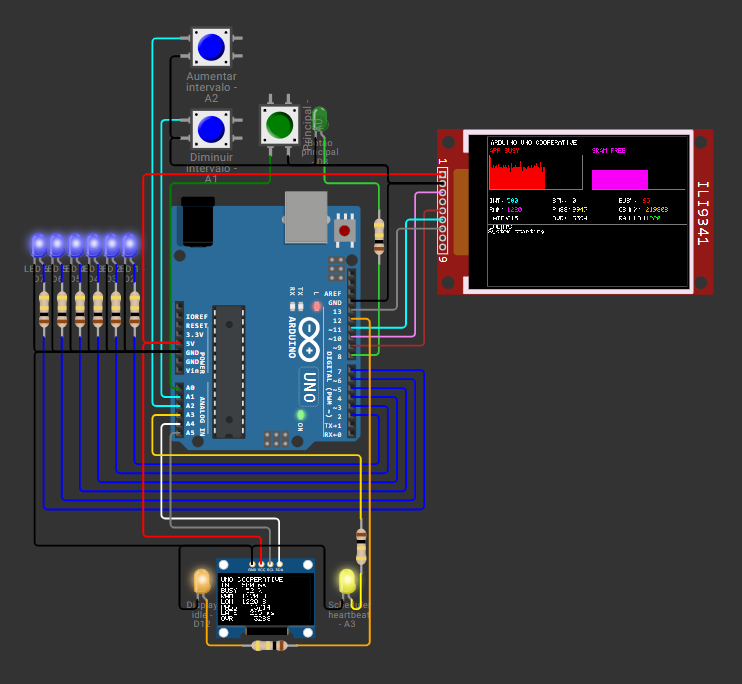

# Arduino Uno Cooperative

Firmware para Arduino Uno R3 que explora concorrência cooperativa sem RTOS,
threads ou `TaskScheduler`. Deriva conceitualmente do projeto `esp32-asyncio`
(MicroPython/`asyncio`), mas usa um escalonador cooperativo nativo e estático
em C++, adequado às restrições do ATmega328P. Onze tarefas cooperativas
controlam seis LEDs azuis independentes, três botões com debounce não
bloqueante, um LED verde, dois indicadores de atividade, um OLED SSD1306
diagnóstico, uma TFT ILI9341 principal e instrumentação de tempo e SRAM.

**Documentação completa:** [Português](docs/PT/README.md) · [English](docs/EN/README.md)

**Relatório técnico (Português):** [`report/relatorio.pdf`](report/relatorio.pdf)

**Simulação no Wokwi:** <https://wokwi.com/projects/472743544463123457>

## Execução rápida

1. Abra o link do Wokwi ou importe `diagram.json`, `sketch.ino`, os arquivos
   `.h` e `libraries.txt` em um projeto Arduino Uno.
2. Inicie a simulação.
3. Use os botões para alternar o LED verde e ajustar o intervalo compartilhado
   dos seis LEDs azuis (125-4000 ms).
4. Acompanhe métricas em tempo real na TFT, no OLED e no monitor serial
   (115200 baud).

## Estrutura

| Caminho | Conteúdo |
|---|---|
| `sketch.ino` + `*.h` | Firmware Arduino/C++ (escalonador, botões, métricas, displays) |
| `diagram.json` | Circuito e layout do Wokwi |
| `libraries.txt` | Dependências instaladas pelo Wokwi |
| `docs/PT/` e `docs/EN/` | Documentação técnica bilíngue |
| `tests/` | Sketches diagnósticos isolados para Wokwi web |
| `report/` | Relatório técnico em LaTeX e PDF |

## Validação

A pasta `tests/` contém sketches independentes que isolam partes do hardware
(LEDs, botões, displays, escalonador). Eles não substituem a validação
integrada — use `docs/PT/validation-checklist.md` (ou
`docs/EN/validation-checklist.md`) para o roteiro completo de aceitação.

## Limitações

Não há RTOS, `TaskScheduler` ou alocação dinâmica após `setup()`. A versão-base
prioriza legibilidade e observabilidade em vez de desempenho máximo; ver
"Trabalhos futuros" em `docs/PT/technical-specification.md`.

**Licença:** CC0 1.0 Universal — consulte [`LICENSE`](LICENSE).
